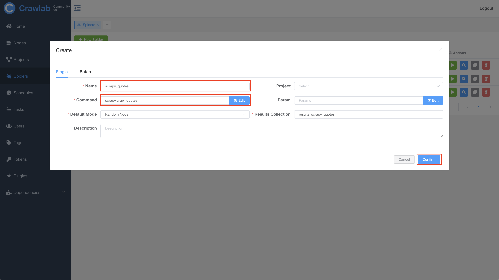
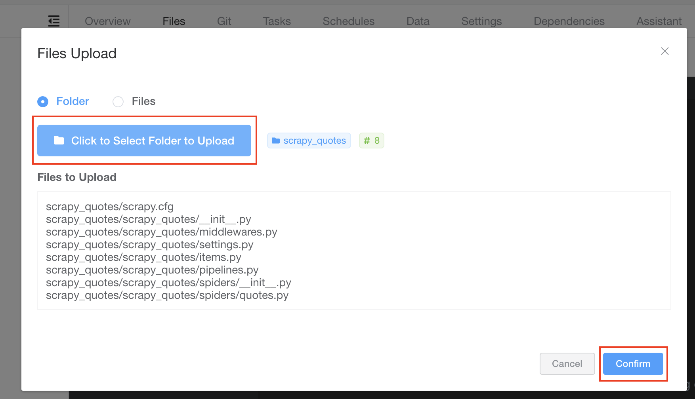
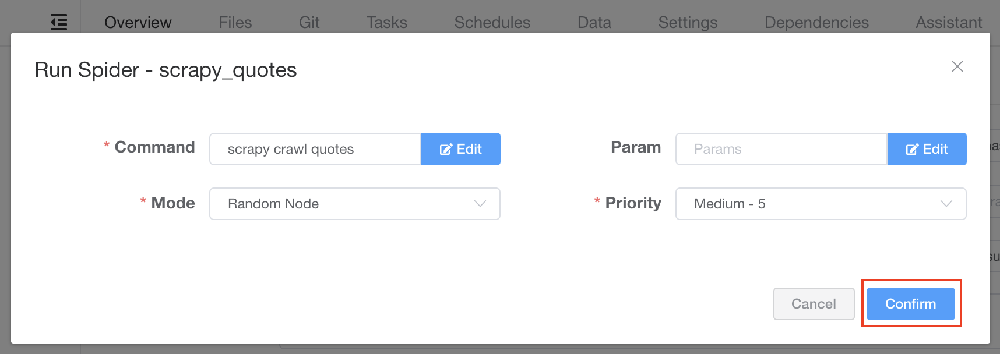
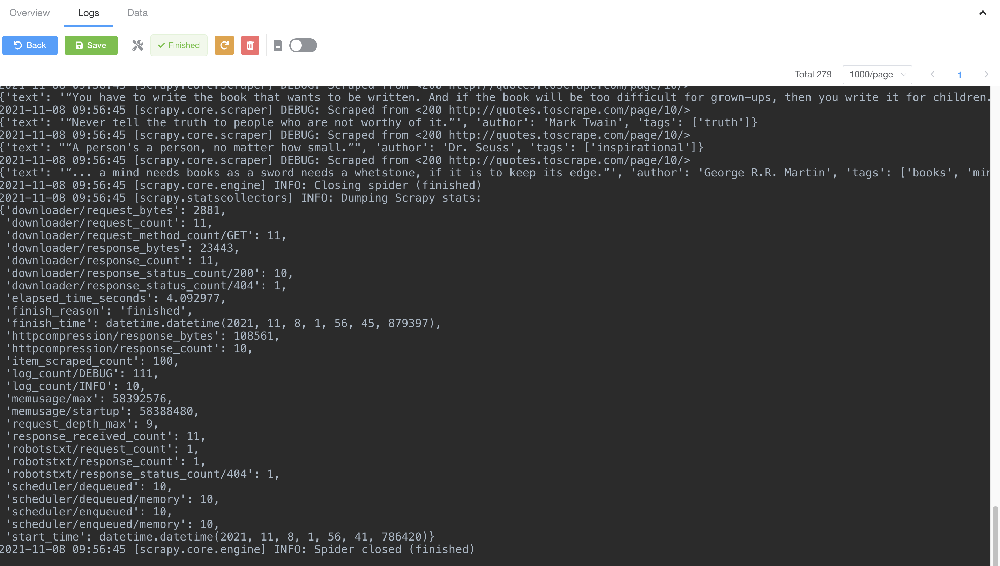

# 快速教程

您已经安装好了 Crawlab 并或许迫不及待的想开始使用它。但在此之前，建议您过一遍这篇快速教程。它将介绍一些基础知识，并让您熟悉 Crawlab 的部分主要功能。

## 介绍

本次教程中，我们将创建一个网络爬虫，以抓取 [Zyte](https://www.zyte.com/) (Scrapy 背后的公司) 提供的 [模拟网站](http://quotes.toscrape.com/) 上的名人名言。接着，我们将上传这个爬虫到 Crawlab，然后运行爬虫来抓取名人名言列表。最后，我们会在 Crawlab 中可视化的查看抓取到的数据。

我们将采用的框架是 [Scrapy](https://scrapy.org/)。它是 Python 编写的最受欢迎的爬虫框架，使用起来非常方便，同时也具备很多强大的功能。

::: warning
我们假设您已经根据 [快速开始](../quick-start) 在本地安装好了 Crawlab。如果没有，请参考 [快速开始](../quick-start) 将其安装在您本地。

由于我们使用的是 Scrapy，请保证在进行任何操作前您已经安装了 [Python](https://www.python.org/) (>=3.6) 以及模块管理工具 [pip](https://pip.pypa.io/en/stable/installation/)。
:::

## 创建爬虫

First thing first, we are going to generate a Scrapy project. Let's start by installing Scrapy.
首先，我们将创建一个 Scrapy 项目，咱们从安装 Scrapy 开始。

```bash
pip install scrapy
```

然后，创建一个名叫 `scrapy_quotes` 的 Scrapy 项目。

```bash
scrapy startproject scrapy_quotes
```

现在您应该可以看到新创建爬虫的目录结构。

然后执行下面命令生成一个新的爬虫。

```bash
cd scrapy_quotes
scrapy genspider quotes quotes.toscrape.com
```

爬虫目录结构应该跟下面类似。

```
scrapy_quotes
├── scrapy.cfg
└── scrapy_quotes
    ├── __init__.py
    ├── items.py
    ├── middlewares.py
    ├── pipelines.py
    ├── settings.py
    └── spiders
        ├── __init__.py
        └── quotes.py
```

打开 `scrapy_quotes/scrapy_quotes/spiders/quotes.py` 并将如下内容替换掉原文件内容。

```python
# scrapy_quotes/scrapy_quotes/spiders/quotes.py
import scrapy

class QuotesSpider(scrapy.Spider):
    name = 'quotes'
    allowed_domains = ['quotes.toscrape.com']
    start_urls = ['http://quotes.toscrape.com/']

    def parse(self, response):
        for quote in response.css("div.quote"):
            yield {
                'text': quote.css("span.text::text").extract_first(),
                'author': quote.css("small.author::text").extract_first(),
                'tags': ','.join(quote.css("div.tags > a.tag::text").extract())
            }

        next_page_url = response.css("li.next > a::attr(href)").extract_first()
        if next_page_url is not None:
            yield scrapy.Request(response.urljoin(next_page_url))
```

然后打开文件 `scrapy_quotes/scrapy_quotes/settings.py` 并将如下代码加入到文件最后。

```python
# 加入到 scrapy_quotes/scrapy_quotes/settings.py 最后
ITEM_PIPELINES = {
    'crawlab.CrawlabPipeline': 300,
}
```

我们现在已经创建好可集成到 Crawlab 的 Scrapy 爬虫，然后我们将上传它至 Crawlab。

## 上传爬虫

现在打开浏览器并导航到 `http://localhost:8080`，并输入默认 用户名/密码 `admin/admin`.

然后导航到 `Spiders` 页面，并点击在左上方 `New Spider`，打开创建对话框。

在对话框中，输入如下信息并点击 `Confirm`，创建新爬虫。
1. Name: `scrapy_quotes`
2. Command: `scrapy crawl quotes`



现在我们已经在 Crawlab 中创建好爬虫了，然后我们需要上传爬虫文件。

点击爬虫名称链接或者右侧名称为 `View` 的蓝色搜索图标，导航至详情页。


在详情页中，点击 `Files` 标签，导航到文件编辑器，然后点击导航条上 `Upload Files` 按钮。


点击 `Click to Select Folder to Upload` 按钮，选择先前创建的 Scrapy 爬虫所在目录，并点击 `Confirm` 上传爬虫。



现在您应该能在左侧导航栏看到已上传的文件和目录。您可以尝试操作它，例如点击展开目录、双击文件打开文件。


## 运行爬虫

运行爬虫非常简单。

我们点击名称为 `Run` 的播放图标按钮，保持默认设置点击 `Confirm`。



## 查看任务

很好！我们已经触发了一个爬虫任务，现在我们应该能够在 `Tasks` 标签中查看它。我们点击 `Tasks` 标签查看一下。


该任务正在运行，我们可以点击右侧的 `View` 按钮查看它的详情。

我们能够点击 `Logs` 标签来查看实时任务日志。



随着爬虫抓取数据，我们能够点击 `Data` 标签查看已抓取到的数据。


## 爬虫统计数据

如果我们退回到 `Spiders` 页面，我们应该能看到爬虫的统计数据


## 总结

这里我们小结一下，我们已经通过一个简单的流程在 Crawlab 上运行了一个 Scrapy 爬虫。
1. 在本地创建 Scrapy 项目
2. 在 Crawlab 上创建爬虫
3. 上传爬虫文件
4. 触发任务
5. 在 Crawlab 上查看实时日志、已抓取到的数据以及爬虫统计数据

## 下一步

这个快速教程让您能够基本了解 Crawlab 并掌握一些基础的使用方法，例如监控爬虫任务日志、查看抓取到的数据。但您需要清楚，Crawlab 不仅限于这些功能，它还包含许多其他的强大功能，例如节点管理、Git 集成以及 依赖安装，这些可能都是您感兴趣的。您可以查看其他章节来学习如何使用那些功能。
